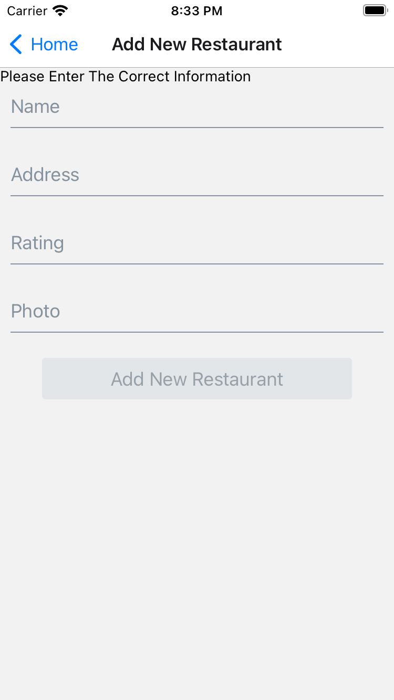
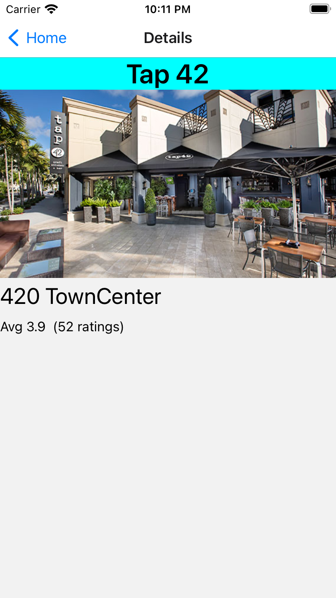

# Created A Restaurant Finder App for Iphone
This is a simple application that shows restaurants within your area and you can also add more restaurants. 

 

## This is the Main page to view the restaurants
This is the selection of restaurants available, with the option to add new restaurants that are near you.

 

 

## If you choose to add a new restaurant 
You simply have to add the following information to add it to the database. If you don't fill all the information, it won't allow you to upload your restaurant to the database

 

 

## You can also select a restaurant 
If you click on the image it will take you to a detail screen that will give you more information on the restaurant, including the average rating and how many people have rated that restaurant. It also includes the address of the restaurant as well.

 

 

### There is also a splash image showing Boca Code for the when it refreshes or is loading the screen

 

 

> Why do I have a folder named ".expo" in my project?

The ".expo" folder is created when an Expo project is started using "expo start" command.

> What do the files contain?

- "devices.json": contains information about devices that have recently opened this project. This is used to populate the "Development sessions" list in your development builds.
- "packager-info.json": contains port numbers and process PIDs that are used to serve the application to the mobile device/simulator.
- "settings.json": contains the server configuration that is used to serve the application manifest.

> Should I commit the ".expo" folder?

No, you should not share the ".expo" folder. It does not contain any information that is relevant for other developers working on the project, it is specific to your machine.

Upon project creation, the ".expo" folder is already added to your ".gitignore" file.
